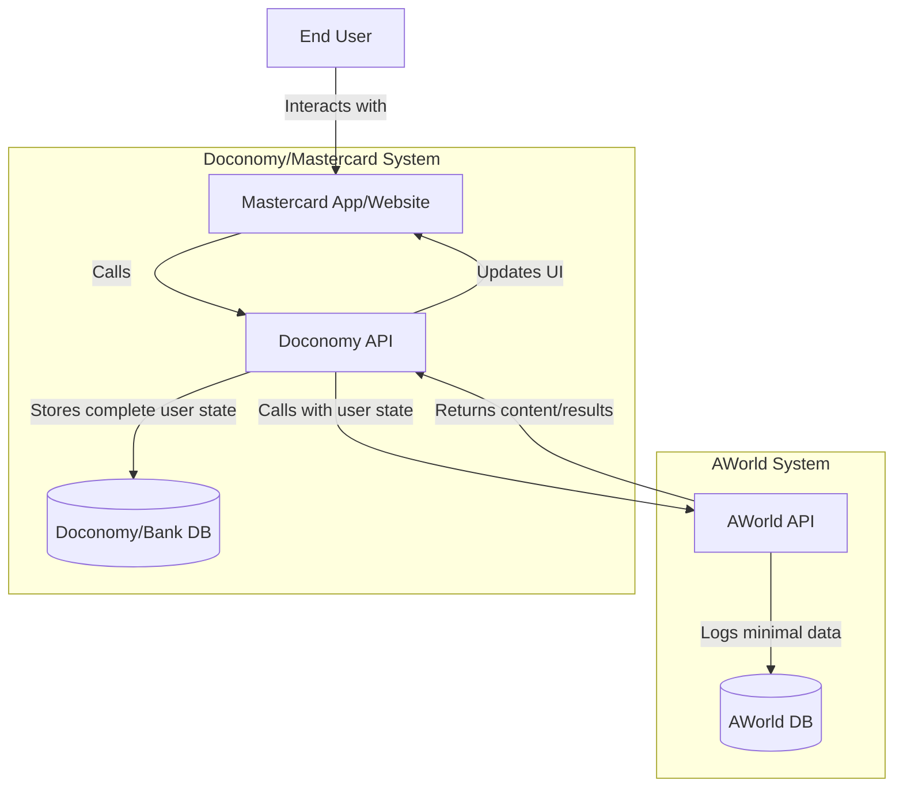
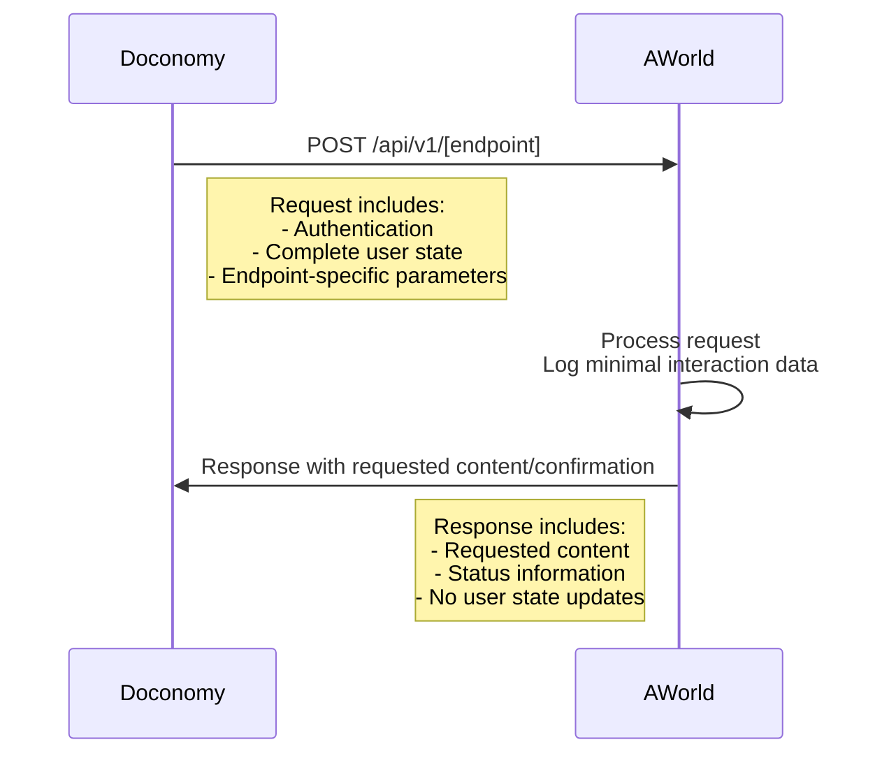
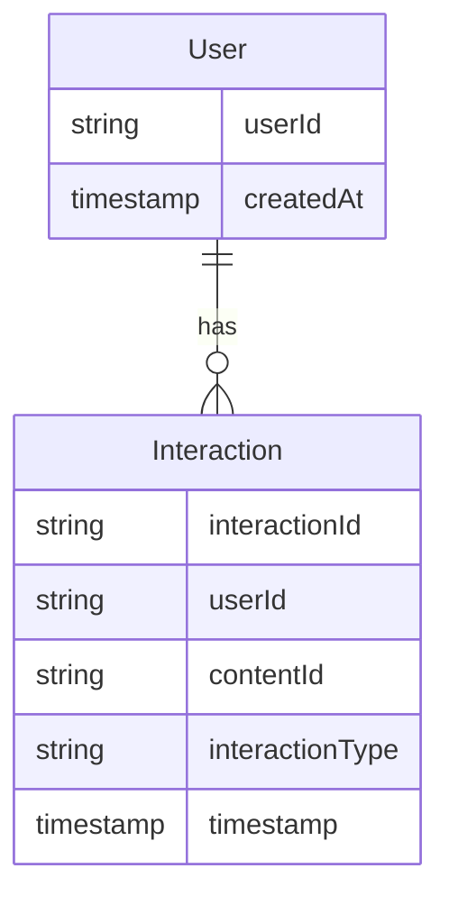
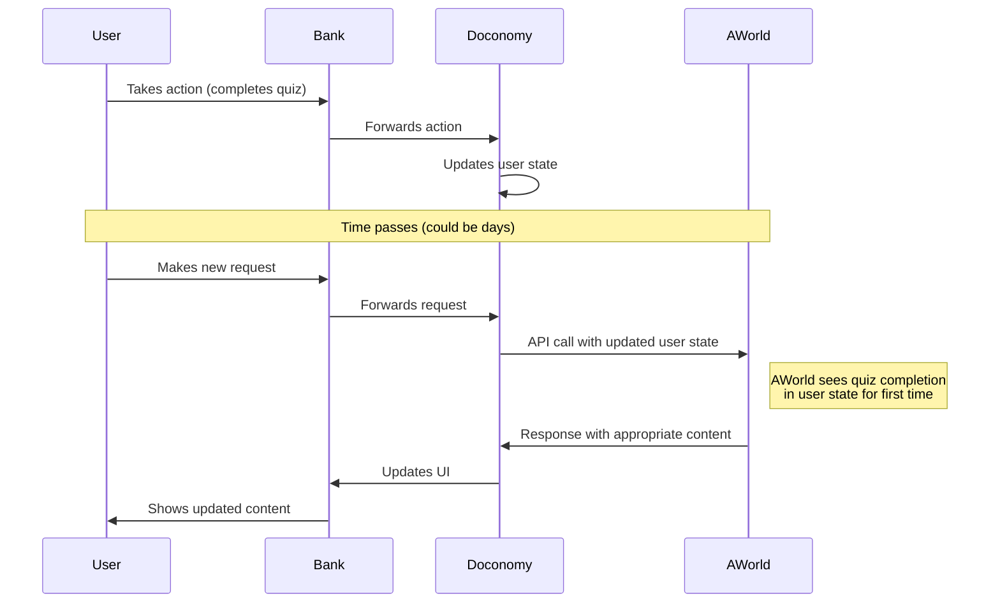

# Architecture Plan for Doconomy-AWorld Integration

## 1. System Overview

This integration will provide a light gamification layer through personalized content (stories, quizzes, tips) for Mastercard users, with the following key characteristics:

- High-volume, low-latency API (millions of requests daily, sub-200ms response time)
- Stateless design where Doconomy/bank maintains the authoritative user state
- Each API call includes the complete user state
- Minimal data storage on AWorld side (user IDs and interaction timestamps)
- OAuth2 authentication
- Cloud-native microservices architecture using Node.js/TypeScript



## 2. API Design

### 2.1 API Endpoints

AWorld will expose the following RESTful API endpoints:

1. **Personalized Story Delivery**
   - `GET /api/v1/stories`
   - Provides personalized stories/tips based on user state

2. **Story Completion Submission**
   - `POST /api/v1/stories/{storyId}/answers`
   - Processes quiz answers and returns results

3. **Quiz Delivery**
   - `GET /api/v1/quizzes`
   - Delivers appropriate quizzes based on user state

4. **Quiz Answer Submission**
   - `POST /api/v1/quizzes/{quizId}/answers`
   - Processes quiz answers and returns results

### 2.2 Request/Response Format

All API requests will follow a similar pattern:



**Sample Request Format:**

```json
{
  "userState": {
    "userId": "user123",
    "preferences": { ... },
    "completedQuizzes": [ ... ],
    "viewedStories": [ ... ],
    "exp": 1250,
    "level": 3,
    ...
  },
  "requestParams": {
    // Endpoint-specific parameters
    ...
  }
}
```

**Sample Response Format:**

```json
{
  "status": "success",
  "data": {
    // Endpoint-specific response data
    ...
  }
}
```

## 3. Data Storage Model

AWorld will maintain minimal storage for reporting purposes:



- **User**: Stores only the user ID and creation timestamp
- **Interaction**: Records minimal interaction data (content views, quiz completions, etc.)

## 4. Handling Asynchronous Updates

Since updates about user actions may come asynchronously (even days later), the system is designed to be idempotent and handle delayed information:


