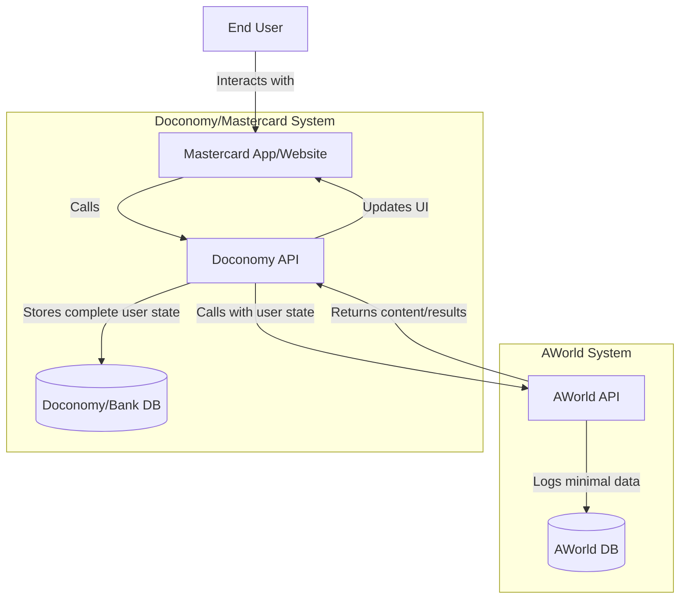
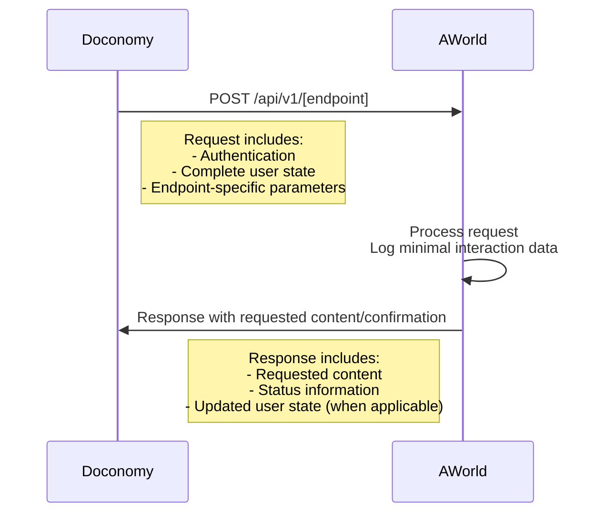
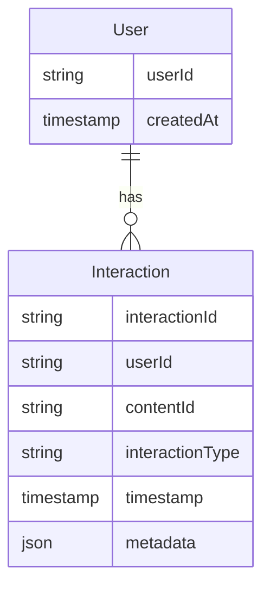
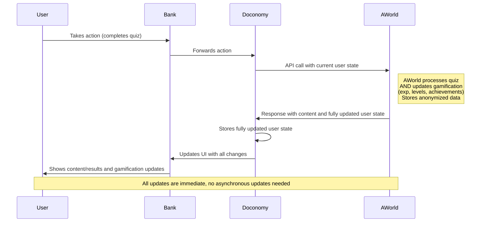
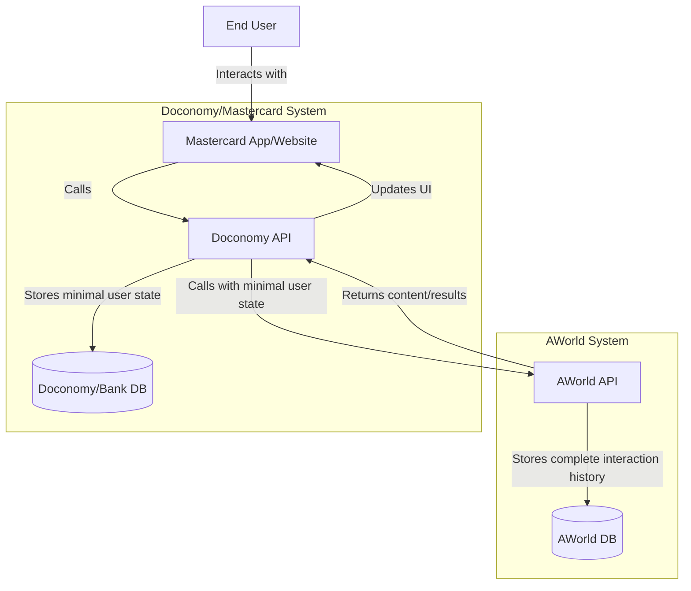
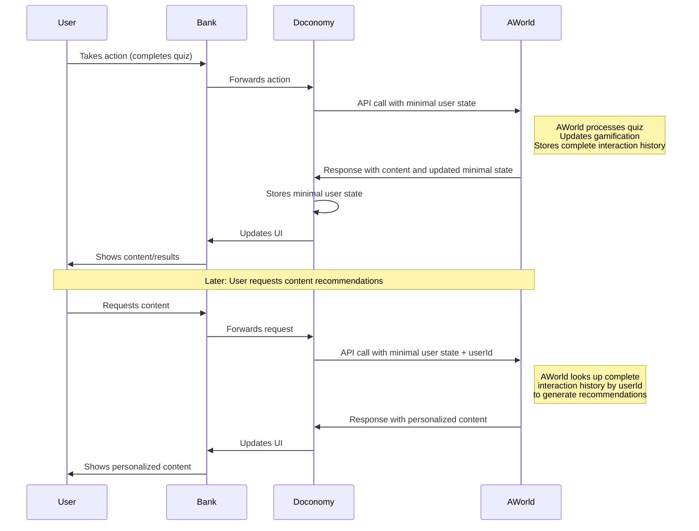

# Architecture Plan for Doconomy-AWorld Integration

## 1. System Overview

This integration will provide a light gamification layer through personalized content (stories, quizzes, tips) for Mastercard users, with the following key characteristics:

- High-volume, low-latency API (millions of requests daily, sub-200ms response time)
- Stateless design where Doconomy/bank maintains the authoritative user state
- Each API call includes the complete user state
- Minimal data storage on AWorld side (user IDs and anonymized interaction data for reporting purposes)
- OAuth2 authentication
- Cloud-native microservices architecture using Node.js/TypeScript



## 2. API Design

### 2.1 API Endpoints

AWorld will expose the following RESTful API endpoints:

1. **Personalized Story Delivery**
   - `GET /api/v1/stories`
   - Provides personalized stories/tips based on user state

2. **Story Completion Submission**
   - `POST /api/v1/stories/{storyId}/answers`
   - Processes quiz answers and returns results

3. **Quiz Delivery**
   - `GET /api/v1/quizzes`
   - Delivers appropriate quizzes based on user state

4. **Quiz Answer Submission**
   - `POST /api/v1/quizzes/{quizId}/answers`
   - Processes quiz answers and returns results

### 2.2 Request/Response Format

All API requests will follow a similar pattern:



**Sample Request Format:**

```json
{
  "userState": {
    "userId": "user123",
    "preferences": { ... },
    "completedQuizzes": [ ... ],
    "viewedStories": [ ... ],
    "exp": 1250,
    "level": 3,
    ...
  },
  "requestParams": {
    // Endpoint-specific parameters
    ...
  }
}
```

**Sample Response Format:**

```json
{
  "status": "success",
  "data": {
    // Endpoint-specific response data
    ...
  },
  "updatedUserState": {
    // Updated user state (when applicable)
    "userId": "user123",
    "exp": 1300,  // Updated from 1250
    "level": 3,
    "completedQuizzes": [ ... ],  // With newly completed quiz
    ...
  }
}
```

## 3. Data Storage Model

AWorld will maintain storage of anonymized data for reporting and analytics purposes:



- **User**: Stores only the user ID and creation timestamp
- **Interaction**: Records anonymized interaction data (content views, quiz completions, etc.)

This storage is separate from the authoritative user state maintained by Doconomy/bank but allows AWorld to generate reports and analytics on content performance and user engagement patterns.

## 4. Synchronous Gamification Updates

The primary approach uses synchronous gamification updates where all logic (exp, levels, etc.) is processed immediately:



This approach couples the business logic of different domains (quiz processing and gamification) but provides immediate feedback to users about their progress. The trade-off is increased complexity in the AWorld system, which now needs to handle all gamification logic synchronously.

## 5. Alternative Approach for Large Content Libraries

### Plan B: Minimal State Storage on Doconomy/Bank Side

If the bank decides to offer a very large content library (e.g., thousands of stories, quizzes, etc.), storing all interaction history in the user state on Doconomy/bank side could become problematic. In this scenario, an alternative approach would be:



In this approach:

1. Doconomy/bank stores only essential user state:
   - User ID
   - Current level
   - Total experience points
   - Other minimal gamification metrics

2. AWorld stores the complete interaction history:
   - All viewed stories
   - All completed quizzes with answers
   - Detailed interaction timestamps
   - Content recommendations history



This approach is recommended only if the content library is expected to grow significantly large, as it shifts more responsibility to the AWorld system.
