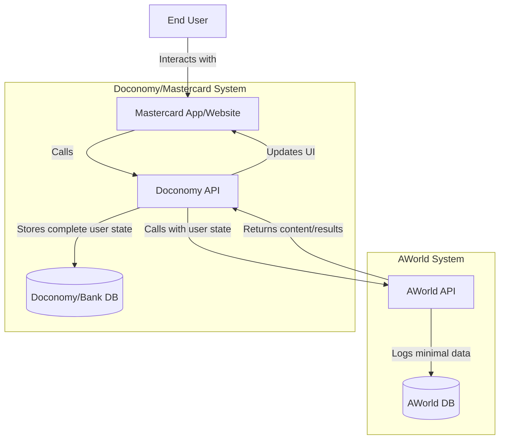
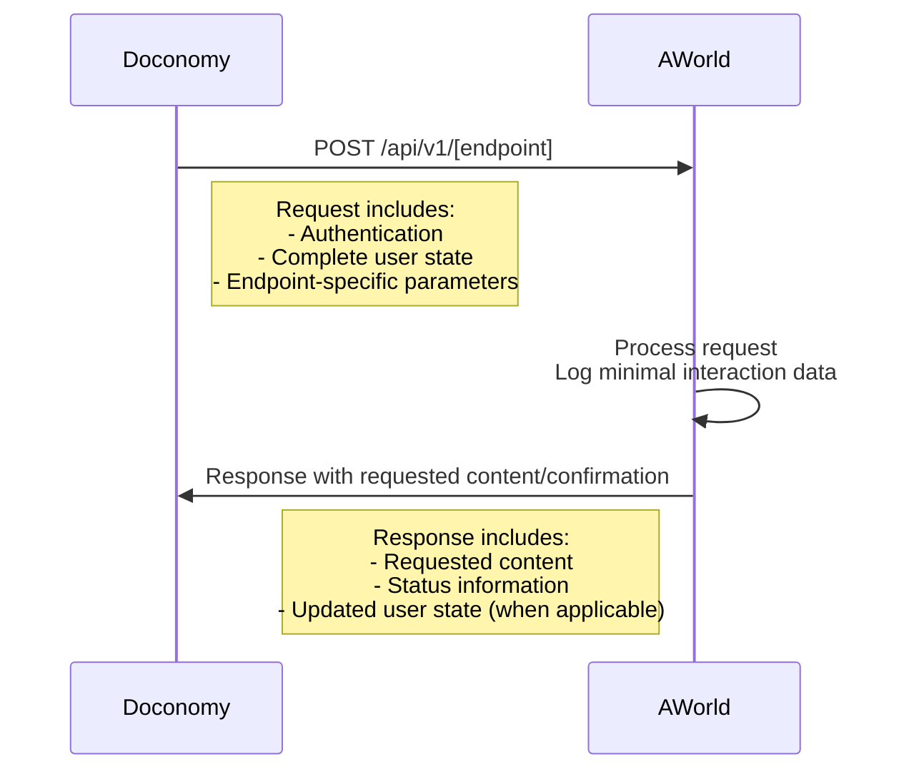
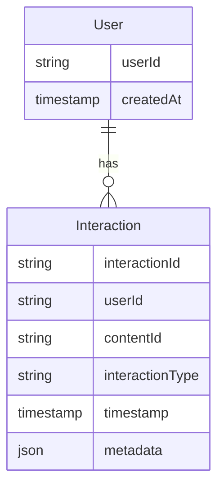
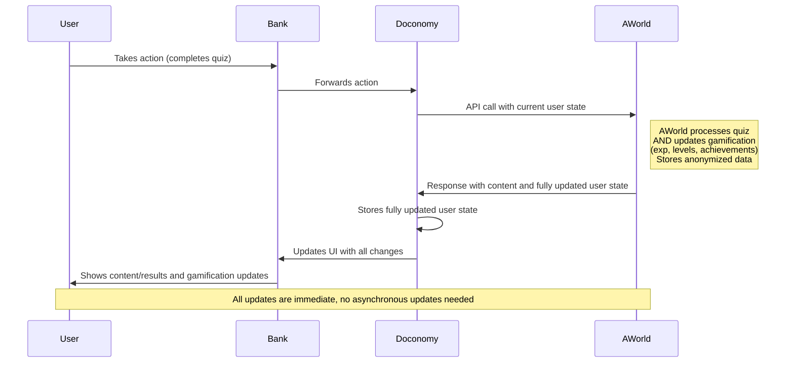
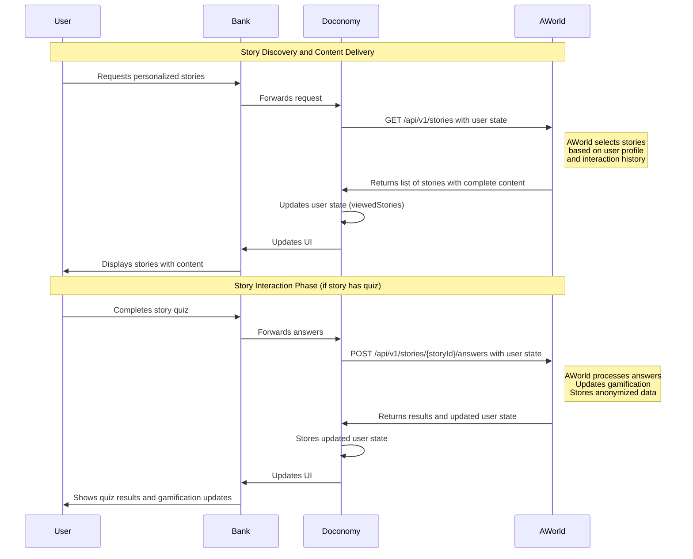
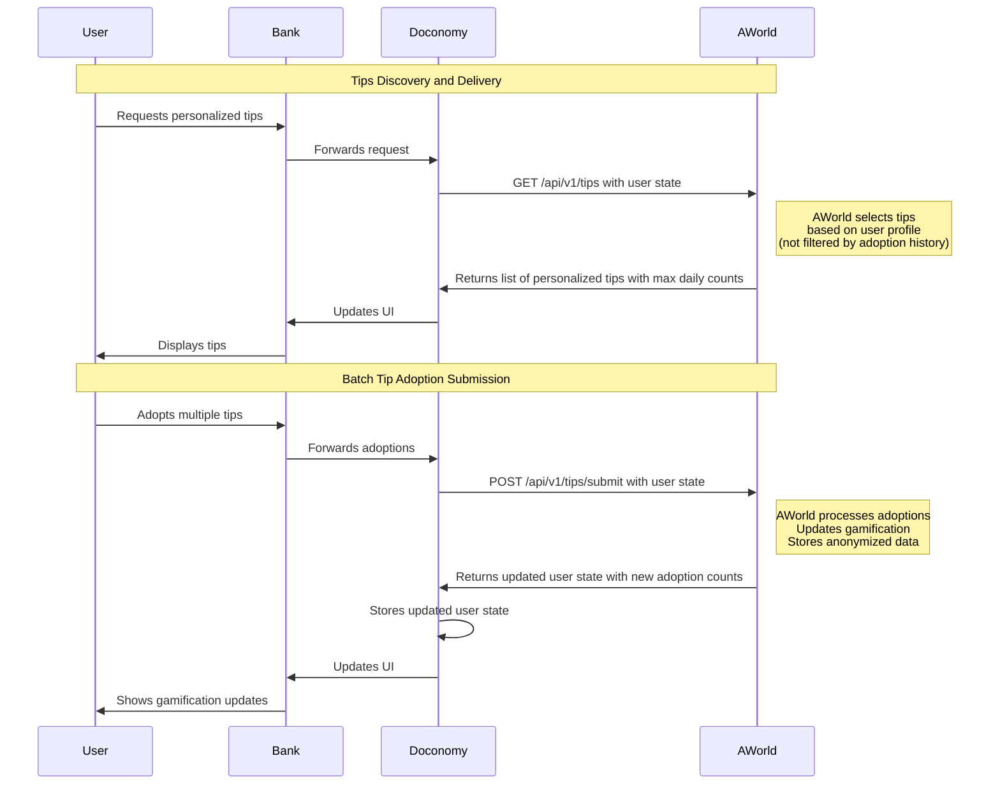
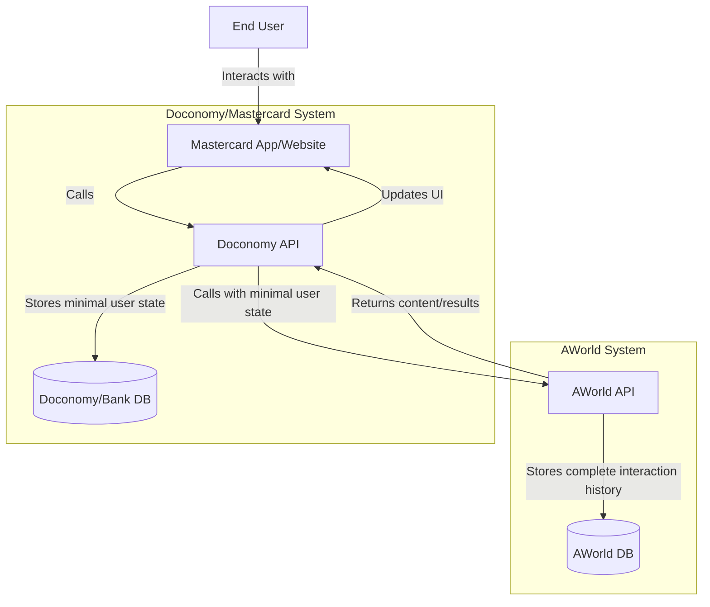
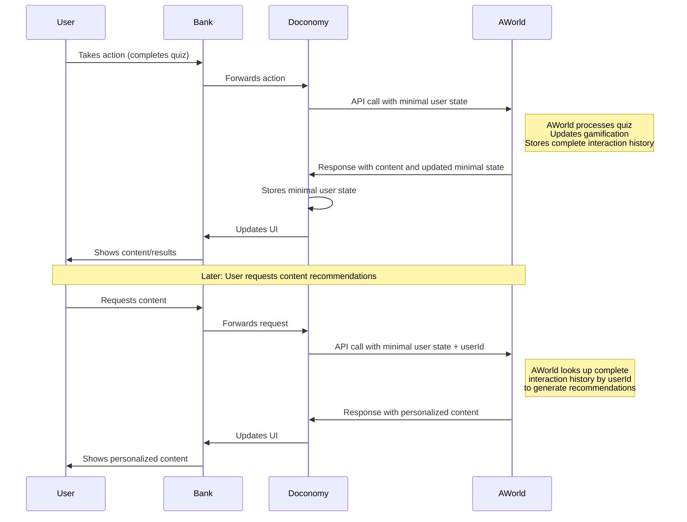

# Architecture Plan for Doconomy-AWorld Integration

## Introduction

This document outlines the architecture for integrating AWorld's light gamification and personalized content services with Doconomy's platform for Mastercard users. The integration aims to enhance user engagement through interactive stories, quizzes, and sustainability tips while maintaining a clear separation of concerns between systems.

The unique challenge of this integration lies in its stateless nature and the requirement for Doconomy/Mastercard to maintain the authoritative user state. This document presents a solution that balances performance, scalability, and user experience while respecting these constraints.

## 1. System Overview

The Doconomy-AWorld integration creates a seamless experience for end users while maintaining a clear separation between systems. Mastercard users will interact with personalized content and gamification elements without being aware of the underlying integration between Doconomy and AWorld.

At its core, this integration follows a stateless API design pattern where Doconomy maintains the authoritative user state and passes it to AWorld with each request. AWorld processes these requests, delivers appropriate content, and returns any necessary state updates to Doconomy.

This integration will provide a light gamification layer through personalized content (stories, quizzes, tips) for Mastercard users, with the following key characteristics:

- High-volume, low-latency API (millions of requests daily, sub-200ms response time)
- Stateless design where Doconomy/bank maintains the authoritative user state
- Each API call includes the complete user state
- Minimal data storage on AWorld side (user IDs and anonymized interaction data for reporting purposes)
- OAuth2 authentication
- Cloud-native microservices architecture



## 2. API Design

The API design is a critical component of this integration, as it defines how Doconomy and AWorld will communicate. The design prioritizes performance, clarity, and statelessness while ensuring that all necessary information is exchanged efficiently.

Given the high-volume requirements (millions of requests daily) and strict performance constraints (sub-200ms response times), the API is designed to be lightweight yet comprehensive. Each request includes the complete user state, allowing AWorld to make informed decisions without maintaining its own copy of user data.

### 2.1 API Endpoints

AWorld will expose a set of RESTful API endpoints that enable Doconomy to request personalized content and submit user interactions. These endpoints are designed to be intuitive, consistent, and aligned with RESTful best practices.

AWorld will expose the following RESTful API endpoints:

1. **Personalized Story Delivery**
   - `GET /api/v1/stories`
   - Provides personalized stories/tips based on user state

2. **Story Completion Submission**
   - `POST /api/v1/stories/{storyId}/answers`
   - Processes story's quizzes answers and returns results

3. **Quiz Delivery**
   - `GET /api/v1/quizzes`
   - Delivers appropriate quizzes based on user state

4. **Quiz Answer Submission**
   - `POST /api/v1/quizzes/{quizId}/answers`
   - Processes quiz answers and returns results

5. **Tips Delivery**
   - `GET /api/v1/tips`
   - Delivers personalized sustainability tips based on user state

6. **Tip Adoption Submission**
   - `POST /api/v1/tips/submit`
   - Records that the user has adopted the behavior described in one or more tips and returns updated gamification state

### 2.2 Request/Response Format

The request and response format is designed to be consistent across all endpoints, making the API intuitive to use and easy to maintain. The format supports the stateless nature of the integration by including the complete user state in each request and returning any necessary updates in the response.

This approach eliminates the need for complex state synchronization mechanisms between systems and ensures that Doconomy always has the most up-to-date information about the user's interactions with AWorld content.

All API requests will follow a similar pattern:



**Sample Request Format:**

```json
{
  "userState": {
    "userId": "user123",
    "preferences": { ... },
    "completedQuizzes": [ ... ],
    "viewedStories": [ ... ],
    "tipAdoptions": {
      "tip123": {
        "dailyCounts": {
          "2025-04-29": 3,
          "2025-04-30": 2
        }
      },
      "tip456": {
        "dailyCounts": {
          "2025-04-30": 1
        }
      }
    },
    "exp": 1250,
    "level": 3,
    ...
  },
  "requestParams": {
    // Endpoint-specific parameters
    "tipAdoptions": [
      {
        "tipId": "tip123"
      },
      {
        "tipId": "tip456"
      }
    ]
  }
}
```

**Sample Response Format:**

```json
{
  "status": "success",
  "data": {
    // Endpoint-specific response data
    "tips": [
      {
        "tipId": "tip123",
        "title": "Use a bike for short trips",
        "description": "For trips under 2 miles, consider using a bicycle instead of a car",
        "category": "transportation",
        "maxDailyCount": 3,
        "currentDailyCount": 2,  // From user state for today
      },
      {
        "tipId": "tip456",
        "title": "Turn off lights when leaving a room",
        "description": "Save energy by turning off lights in unoccupied rooms",
        "category": "energy",
        "maxDailyCount": 1,
        "currentDailyCount": 1,  // From user state for today
      }
    ]
  },
  "updatedUserState": {
    // Updated user state (when applicable)
    "userId": "user123",
    "exp": 1300,  // Updated from 1250
    "level": 3,
    "completedQuizzes": [ ... ],  // With newly completed quiz
    "tipAdoptions": {
      "tip123": {
        "dailyCounts": {
          "2025-04-29": 3,
          "2025-04-30": 3  // Updated from 2
        }
      },
      "tip456": {
        "dailyCounts": {
          "2025-04-30": 2  // Updated from 1
        }
      }
    },
    ...
  }
}
```

## 3. Data Storage Model

While the primary user state is maintained by Doconomy/bank, AWorld needs to store some data for reporting, analytics, and operational purposes. This data storage is designed to be minimal and focused on anonymized interaction data rather than comprehensive user profiles.

The data storage model balances the need for meaningful analytics with privacy considerations and system performance. By storing only what's necessary, AWorld can generate valuable insights without duplicating the user state maintained by Doconomy.

AWorld will maintain storage of anonymized data for reporting and analytics purposes:



- **User**: Stores only the user ID and creation timestamp
- **Interaction**: Records anonymized interaction data (content views, quiz completions, tip adoptions, etc.)

This storage is separate from the authoritative user state maintained by Doconomy/bank but allows AWorld to generate reports and analytics on content performance and user engagement patterns.

## 4. Synchronous Gamification Updates

A key aspect of this integration is how gamification updates are handled. The gamification elements (experience points, levels, achievements) enhance user engagement and provide feedback on sustainable behaviors. How these updates are processed affects both the user experience and the system architecture.

After careful consideration of the requirements and constraints, we recommend a synchronous approach to gamification updates. This approach provides immediate feedback to users and simplifies the overall system by eliminating the need for complex asynchronous update mechanisms.

The primary approach uses synchronous gamification updates where all logic (exp, levels, etc.) is processed immediately:



This approach couples the business logic of different domains (quiz processing and gamification) but provides immediate feedback to users about their progress. The trade-off is increased complexity in the AWorld system, which now needs to handle all gamification logic synchronously.

## 5. Stories Workflow

The stories workflow illustrates how users interact with personalized stories, including requesting stories with complete content and completing any associated quizzes. This workflow is a key part of the user experience and demonstrates how the stateless API design efficiently delivers content while minimizing API calls.



This workflow demonstrates the complete lifecycle of story interaction, from discovery and content delivery to quiz interaction. By delivering complete story content in the initial request, the API minimizes the number of calls needed while still providing a rich user experience. The stateless nature of the API ensures that each interaction is self-contained with the user state that's passed with each request.

## 6. Tips Workflow

The tips workflow illustrates how users interact with sustainability tips, including requesting personalized tips and submitting tip adoptions. This workflow demonstrates the efficiency of batch operations for minimizing API calls while still providing a rich gamification experience.



This workflow demonstrates how multiple tip adoptions can be submitted in a single API call, improving efficiency and reducing network overhead. Unlike stories and quizzes, tips are always returned regardless of previous adoptions, with each tip including information about the maximum number of times it can be adopted per day and the user's current adoption count (e.g., "2 out of 3 times for today"). This approach encourages repeated engagement with the same tips over time, promoting consistent sustainable behaviors.

## 7. Alternative Approach for Large Content Libraries

While the primary architecture assumes a manageable content library size, it's prudent to consider how the system would scale if the content library grows significantly. This section presents an alternative approach that addresses potential scalability challenges with very large content libraries.

The main concern with large content libraries is the growing size of the user state that must be passed with each request. If a user interacts with thousands of content items, storing all these interactions in the user state could lead to performance issues and increased data transfer costs.

### Plan B: Minimal State Storage on Doconomy/Bank Side

This alternative approach shifts more of the storage responsibility to AWorld while keeping the essential gamification state with Doconomy/bank. It maintains the stateless API design while reducing the data volume transferred with each request.

If the bank decides to offer a very large content library (e.g., thousands of stories, quizzes, etc.), storing all interaction history in the user state on Doconomy/bank side could become problematic. In this scenario, an alternative approach would be:



In this approach:

1. Doconomy/bank stores only essential user state:
   - User ID
   - Current level
   - Total experience points
   - Other minimal gamification metrics

2. AWorld stores the complete interaction history:
   - All viewed stories
   - All completed quizzes with answers
   - All tip adoptions with daily counts
   - Detailed interaction timestamps
   - Content recommendations history



This approach is recommended only if the content library is expected to grow significantly large, as it shifts more responsibility to the AWorld system.
